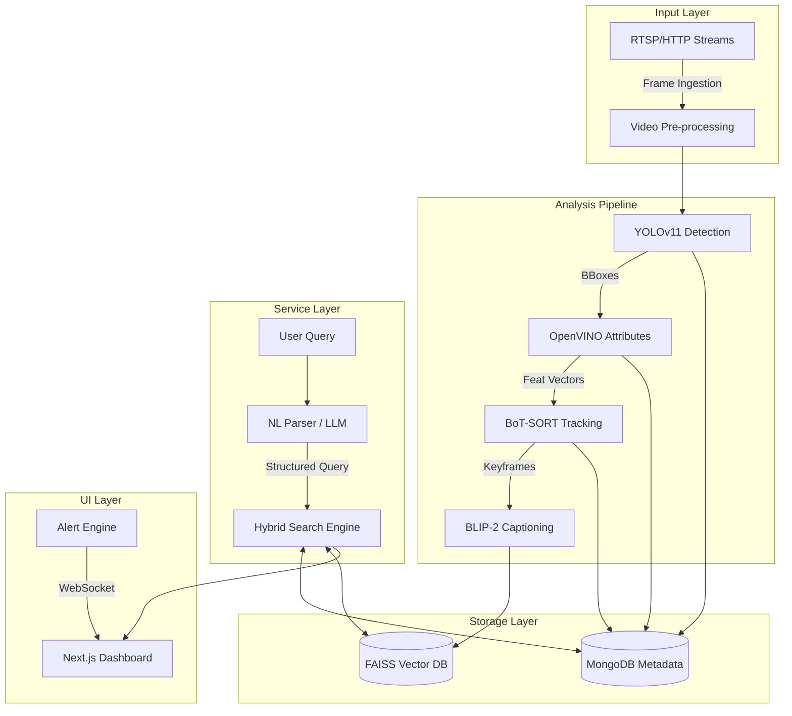

# AI-Powered Surveillance & Crowd Management with Natural Language Querying


## 📖 Overview

This project transforms passive CCTV video streams into a searchable, proactive intelligence asset. It integrates computer vision, deep learning, and Natural Language Processing (NLP) to enable real-time monitoring, crowd density estimation, and forensic video retrieval using conversational queries.

Unlike traditional systems that rely on manual timestamp scrubbing, this solution employs a **Retrieval-Augmented Generation (RAG)** pipeline. Users can query footage using natural language (e.g., *"Show me people wearing red jackets near the exit after 10 PM"*) to retrieve contextually relevant video clips.

---

## 🚀 Key Features


### Core Capabilities

*   **Natural Language Video Retrieval**
    Utilizes a semantic search engine (LLM + Vector Search) to translate conversational queries into structured database filters and vector similarity searches.

*   **Real-Time Analysis Pipeline**
    *   **Object Detection & Segmentation:** Powered by **YOLOv11-seg** for high-accuracy detection.
    *   **Person Attribute Recognition:** Uses **OpenVINO** to extract granular details (gender, clothing color, accessories).
    *   **Multi-Object Tracking:** Implements **BoT-SORT** with OSNet for persistent identity tracking across frames.

*   **Hybrid Search Engine**
    Combines structured metadata queries (MongoDB) with semantic vector embeddings (FAISS) for multimodal retrieval.

*   **Automated VLM Captioning**
    Generates descriptive textual summaries of video scenes using **BLIP-2** (Vision-Language Model) for deeper semantic understanding.

*   **Proactive Alerting**
    Configurable rule-based engine for detecting anomalies, intrusions, and crowd density violations in real-time.

---

## 🏗️ System Architecture

The system operates on a microservices architecture comprising five core modules:

1.  **Input Layer:** Ingests RTSP/HTTP streams and local video files.
2.  **Analysis Pipeline:** Runs YOLOv11, OpenVINO, and BLIP-2 frame-by-frame.
3.  **Storage Layer:**
    *   **MongoDB:** Stores structured metadata (timestamps, class IDs, attributes).
    *   **FAISS:** Stores high-dimensional vector embeddings for semantic search.
4.  **Service Layer:** Handles NL parsing, hybrid search logic, and alert processing.
5.  **User Interface:** A Next.js dashboard for monitoring and querying.



---

## 🛠️ Tech Stack

*   **Frontend:** Next.js (React/TypeScript), Tailwind CSS.
*   **Backend:** Python, FastAPI.
*   **Computer Vision & AI:**
    *   PyTorch, OpenCV.
    *   Ultralytics YOLOv11m-seg.
    *   OpenVINO Toolkit.
    *   BoT-SORT & OSNet.
    *   BLIP-2 / ViT-GPT2.
*   **Database & Search:** MongoDB, FAISS (Facebook AI Similarity Search).
*   **LLM Integration:** OpenAI API (for query translation).

---

## 📊 Performance

*   **Detection Accuracy:** ~96.5% precision for Person class; ~91% for Gender recognition.
*   **Retrieval Latency:** Sub-second response time (~107ms) for searching databases with up to 500,000 indexed frames.
*   **NL Parsing Accuracy:** 94% success rate in converting natural language to database filters.

---

## 🔮 Future Roadmap

*   **Multi-Camera Re-Identification:** Cross-camera tracking for continuous monitoring.
*   **Edge Deployment:** Optimization for low-power edge devices.
*   **Predictive Analytics:** Temporal models to predict crowd risks.

---

## Getting Started

Follow these instructions to set up the project locally for development.

### Prerequisites

*   Python 3.10+
*   Node.js 18+
*   MongoDB Instance
*   CUDA-compatible GPU (Recommended for inference acceleration)

### Backend Setup

1.  **Navigate to the backend directory:**
    ```bash
    cd backend
    ```

2.  **Create and activate a virtual environment:**
    ```bash
    python -m venv venv
    source venv/bin/activate  # On Windows: venv\Scripts\activate
    ```

3.  **Install dependencies:**
    ```bash
    pip install -r requirements.txt
    ```

4.  **Configure environment:**
    Create a `.env` file in the `backend` directory. Here is a template with standard defaults:

    ```ini
    # App Settings
    APP_NAME="AI-Powered-Surveillance-System-with-Natural-Language-based-Querying"
    DEBUG=true
    ALLOWED_ORIGINS="http://localhost:3000"

    # Database
    MONGODB_URI="mongodb://localhost:27017"
    MONGO_DB_NAME="ai_surveillance"

    # AI & ML Models
    MODEL_PATH="yolo11m-seg.pt"
    # LLM Provider (openai or ollama)
    LLM_PROVIDER="openai"
    OPENAI_API_KEY="sk-..."
    # If using Ollama locally
    # OLLAMA_BASE_URL="http://localhost:11434"

    # Semantic Search & Vector Store
    ENABLE_SEMANTIC=true
    EMBED_DEVICE="cuda" # Use 'cpu' if no GPU available
    HF_TOKEN="hf_..."
    ```

5.  **Start the server:**
    ```bash
    uvicorn main:app --reload
    ```

### Frontend Setup

1.  **Navigate to the frontend directory:**
    ```bash
    cd frontend
    ```

2.  **Install dependencies:**
    ```bash
    npm install
    ```

3.  **Start the development server:**
    ```bash
    npm run dev
    ```

4.  **Access the application:**
    Open your browser and navigate to `http://localhost:3000`.

---

## System Requirements

| Component | Minimum Specification | Recommended Specification |
|:---|:---|:---|
| **CPU** | 4 Cores | 8+ Cores |
| **RAM** | 16 GB | 32 GB+ |
| **GPU** | NVIDIA GTX 1060 (6GB) | NVIDIA RTX 3060 (12GB) or higher |
| **Storage** | 50 GB SSD | 500 GB NVMe SSD |
